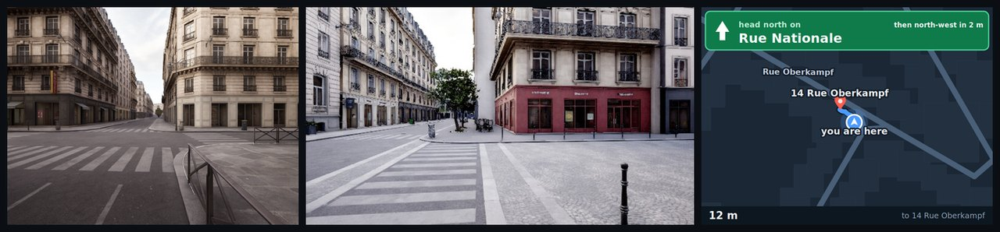

<h1 align="center">DeliveryGym</h1>

<p align="center"><b>An RL environment for long-horizon embodied agent planning — and the courier benchmark it scores.</b></p>

<p align="center">
  <a href="https://arxiv.org/abs/2609.19801"></a>
  <a href="https://github.com/mk322/DeliveryGym/actions/workflows/tests.yml"></a>
  
  <a href="https://huggingface.co/datasets/mk322/DeliveryGym-albums"></a>
  <a href="LICENSE"></a>
</p>

<p align="center"></p>

<p align="center">
  <a href="#install">Install</a> ·
  <a href="#evaluate-a-model">Evaluate</a> ·
  <a href="#train">Train</a> ·
  <a href="#the-any-point-track">Any-point track</a> ·
  <a href="#what-is-held-out">What is held out</a> ·
  <a href="docs/RUNNING.md">Environment API</a> ·
  <a href="docs/TASK_DESIGN.md">Task design</a>
</p>

---

A vision-language model is the courier. It reads the street, the phone and the
clock; it walks, waits at lights, goes round barriers, collects and hands over,
for money, in rendered cities. Each turn it sees the photographs above — the
streets leaving the junction, the phone with the route drawn on it, the order
slip, the clock, its own notes — and answers with one thought and one tool
call:

```
THOUGHT: the route runs east and photograph 1 shows Rue de Grenelle is clear; the light is green.
```
```
walk_to("Rue de Grenelle", "east")
```

A delivery pays `3.00 + 0.01 × metres`, in full on time, in part late, nothing
if it never arrives. The dispatcher refills after every delivery, so a shift is
a queue of orders against one clock: what the courier spends on the order in
hand is gone from the next. The score is the money earned before the clock and
the turn cap run out.

| track | action | world |
|---|---|---|
| **Waypoint** — the benchmark and the RL environment | `walk_to(street, bearing)`, one decision per junction | ten rendered cities served from photograph albums: offline, deterministic, thousands of episodes an hour on CPU |
| **Any-point** — pixel goals | `walk_to_pixel(view, u, v)`, a point in one of four photographs | a live Unreal Engine Paris; the pawn walks there over legs the engine itself certified |

Two reference policies bracket any model on the same 64 held-out shifts and
the same 60 turns: a courier that reads only the text, and one that reads the
road graph directly. Both ship here and both run in about a minute on a CPU,
so a number has a floor and a ceiling beside it. The paper reports the
measurements; this repository is how you reproduce them.

<details>
<summary><b>The paper</b> — <a href="https://arxiv.org/abs/2609.19801">arXiv:2609.19801</a>, abstract</summary>

> Executable environments enable LLM agents to learn from the consequences of
> their actions. For embodied agents, those consequences extend beyond whether
> the current task succeeds: completing a delivery can consume the time,
> energy, or money needed for later work. Learning to plan therefore requires
> environments that preserve these dependencies and turn them into feedback
> across a complete trajectory. We introduce DeliveryGym, a 3D environment for
> evaluating and training agents on continuous courier shifts. It couples
> multimodal tool interaction with persistent world dynamics and computes
> trajectory rewards from simulator events, making the costs of an agent's
> decisions available for reinforcement learning (RL). The environment also
> adapts future training shifts to the policy's observed weaknesses while
> keeping evaluation fixed. Across six models and 13 city maps, evaluation
> exposes a gap between reliably executing assigned deliveries and choosing and
> sequencing work over a shift. On the fixed test suite, RL improves
> Qwen3-VL-4B's net income by 54.3%, showing that learning from complete shifts
> improves performance under these coupled constraints. Adapting the training
> environment improves test income by 16.5% over uniform sampling at the same
> rollout budget, indicating that which situations an agent practices also
> matters. DeliveryGym provides an executable setting for studying how agents
> learn to coordinate deliveries and preserve resources for later orders within
> an episode.
</details>

## Install

```bash
git clone https://github.com/mk322/DeliveryGym.git && cd DeliveryGym
pip install -e .                      # Python ≥ 3.11; cairosvg needs libcairo2 (apt) or cairo (conda)
```

**The photographs** are a dataset, not part of the repository: ten cities,
7.8 GB in four parts. Download, join, verify, unpack, and point `ALBUMS_DIR`
at the result:

```bash
pip install -U "huggingface_hub[cli]"
hf download mk322/DeliveryGym-albums --repo-type dataset --local-dir albums
cd albums && cat albums_v3.tar.part0{0,1,2,3} > albums_v3.tar && sha256sum -c SHA256SUMS
mkdir -p /data/albums && tar -xf albums_v3.tar -C /data/albums && cd ..
export ALBUMS_DIR=/data/albums
```

[`docs/INSTALL.md`](docs/INSTALL.md) lists the folders you should end up with.
Evaluation needs nothing else; training needs the pinned trainer stack and four
80 GB cards (below).

## Evaluate a model

64 held-out Paris shifts (seeds 1000–1063), 60 turns each, greedy decoding,
scored through the same adapter the trainer uses. Any OpenAI-compatible
endpoint works; the evaluator itself needs no GPU.

```bash
# serve Qwen3-VL-4B on one 24 GB card
python -m vllm.entrypoints.openai.api_server \
  --model Qwen/Qwen3-VL-4B-Instruct --served-model-name qwen3-vl-4b \
  --port 8000 --max-model-len 16384 --limit-mm-per-prompt '{"image": 16}'

# score it
python -m embodiedbench.eval run --model qwen3-vl-4b --base-url http://127.0.0.1:8000/v1 \
  --split val --workers 4 --out results --tag qwen3-vl-4b

# the bound (a courier that reads the road graph) and the floor (one that reads
# only the text), at the same 60 turns, and a paired comparison
python tools/waypoint_reference.py --out results/ceiling.json
python tools/waypoint_reference.py --objective floor --out results/floor.json
python -m embodiedbench.eval compare results/qwen3-vl-4b.json results/ceiling.json
```

`results/qwen3-vl-4b.json` holds `earnings_mean` with a bootstrap 95 %
interval, `deliveries_mean`, `zero_delivery_rate`, the running earnings at
turns 20/40/60 and the per-seed scores. Episodes ended by the infrastructure
are excluded from every mean and make the exit status non-zero.
`examples/eval_api_model.sh` wraps the serve-and-score pair.

## Train

GRPO through the vendored, pinned VAGEN + verl trainer, in its own
environment:

```bash
conda create -n courier-rl python=3.12 -y && conda activate courier-rl
pip install torch==2.8.0
pip install vllm==0.11.0 ray==2.53.0 transformers==4.57.1 accelerate==1.12.0 ninja
pip install -e vendor/vagen/verl -e vendor/vagen -e .
huggingface-cli download Qwen/Qwen3-VL-4B-Instruct     # MODEL_PATH below is the snapshot directory

MODEL_PATH=/path/to/Qwen3-VL-4B-Instruct ALBUMS_DIR=/data/albums bash examples/train_single_node.sh
```

Training runs on seeds 0–799 at the 60-turn horizon and validates on the 64
held-out shifts the evaluator scores, logging
`val-aux/courier_paris_val/earnings_at_60/mean@1`. Four 80 GB cards by default;
`CARD_GB=24` for four 24 GB cards. `examples/README.md` has the knobs;
`experiments/run_arm.sh <arm>` runs any arm of the paper.

## The any-point track

One delivery per run in a live Unreal Engine Paris, on a certified pool of
doors, crossings and pedestrian ways. The pixel the policy points at is
resolved by the engine, and the pawn walks there only over legs the engine
itself accepted; [`docs/PIXEL_GOAL.md`](docs/PIXEL_GOAL.md) is the runbook.

**The engine-side code is in [`ue/`](ue)**: the `SpPixelGoalSubsystem`, its 25
automation tests, and the three SimWorld classes it drives, MIT-licensed by
SimWorld_SPEAR, with a patch recording exactly what the any-point work changed
([`ue/README.md`](ue/README.md)). The Unreal project those files build inside
is private, so the editor bundle cannot be built outside the team: **ask the
authors for it.** The launcher pins that bundle's seven files by SHA-256 and
checks them before a run starts. The waypoint track needs none of it.

The protocol's sixteen scenarios split into six development and ten held-out
ones (scenarios, not doors: the pool has four doors, and every held-out
scenario uses doors a development scenario also uses). One command runs a
split:

```bash
PIXEL_GOAL_PROTOCOL_OUT=results/anypoint/heldout bash tools/run_pixel_goal_protocol.sh heldout
```

## What is held out

Training seeds are 0–799 and validation seeds 1000–1063 on the waypoint track;
development scenarios are seeds 0 1 2 6 7 9 and held-out scenarios
3 5 12 14 15 16 17 18 23 31 on the any-point track. Both partitions are data in
the repository, asserted by tests. Report on the held-out sets only.

## Repository

```
embodiedbench/
  runtime/city/       CourierEnv: the world and every mechanic
  agent/courier/      prompts, tools, the session, the model client
  training/           CourierGymEnv (the trainer/evaluator adapter), the GRPO launcher
  eval/               embodiedbench.eval: score an endpoint, compare two runs
  runtime/live/       the live-UE backends; runtime/pixel_goal*: any-point navigation
  compiler/           city maps -> road network, albums, signal legibility, obstacles
ue/                   the engine-side any-point code (SpPixelGoalSubsystem and friends)
examples/             eval and training on an ordinary server
experiments/          every arm of the paper, by name
configs/pixel_goal/   the certified pedestrian order pool and its engine audit
tools/                the any-point protocol, the relay endpoint, the reference policies, album bakers
vendor/               VAGEN + verl at pinned commits, and the ten compiled city maps
docs/                 INSTALL · RUNNING · TASK_DESIGN · PIXEL_GOAL
tests/                ~2000 tests; no GPU, no albums, no engine needed
```

## Citation

```bibtex
@article{deliverygym2026,
  title   = {DeliveryGym: An RL Environment for Long-Horizon Embodied Agent
             Planning with Adaptive Curriculum},
  author  = {Kang, Haoqiang and Zhang, Yiming and Guo, Yiyang and Li, Chuying
             and Shen, Jianzhi and Xu, Tianruo Rose and Ye, Xiaokang and
             Qin, Lianhui},
  journal = {arXiv preprint arXiv:2609.19801},
  year    = {2026},
  url     = {https://arxiv.org/abs/2609.19801}
}
```

MIT licence for the code; the photographs are released as a dataset, and `ue/`
carries SimWorld_SPEAR's MIT licence.
